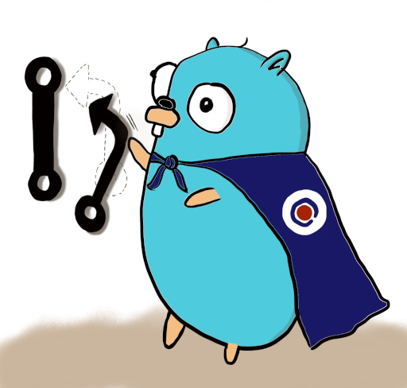

<!--
SPDX-FileCopyrightText: 2022 Risk.Ident GmbH <contact@riskident.com>

SPDX-License-Identifier: CC-BY-4.0
-->

<p align="center">
  
</p>

<h1 align="center">jelease - A newreleases.io ➡️ Jira connector</h1>

[](https://api.reuse.software/info/github.com/RiskIdent/jelease)

Automatically create Jira tickets when a newreleases.io release
is detected using webhooks.

## Configuration

Jelease is configured via YAML files.
See [`jelease.yaml`](./jelease.yaml) for the default values.

### Configuration files

Jelease looks for config files in multiple locations, where the latter overrides
config fields from the former.

On Linux:

1. Default values *(see [`jelease.yaml`](./jelease.yaml))*
2. `/etc/jelease/jelease.yaml`
3. `~/.config/jelease.yaml`
4. `~/.jelease.yaml`
5. `jelease.yaml` *(in current directory)*

On Windows:

1. Default values *(see [`jelease.yaml`](./jelease.yaml))*
2. `%APPDATA%/jelease.yaml`
3. `%USERPROFILE%/.jelease.yaml`
4. `jelease.yaml` *(in current directory)*

On Mac:

1. Default values *(see [`jelease.yaml`](./jelease.yaml))*
2. `/etc/jelease/jelease.yaml`
3. `~/Library/Application Support/jelease.yaml`
4. `~/.jelease.yaml`
5. `jelease.yaml` *(in current directory)*

### JSON Schema

There's also a [JSON Schema](https://json-schema.org/) for the config file,
which gives you warnings and completion support inside your IDE.

Make use of it via e.g:

- [YAML extension](https://marketplace.visualstudio.com/items?itemName=redhat.vscode-yaml)
  for [VS Code](https://code.visualstudio.com/).

- [coc-yaml plugin](https://github.com/neoclide/coc-yaml)
  for [coc.nvim](https://github.com/neoclide/coc.nvim),
  an extension framework for both Vim and NeoVim.

To make use of it, add the following comment to the beginning of your
config file:

```yaml
# yaml-language-server: $schema=https://github.com/RiskIdent/jelease/raw/main/jelease.schema.json
```

## Local usage

1. Create a GitHub PAT (e.g on <https://github.com/settings/tokens>)

2. Create a local config file, e.g at `~/.config/jelease.yaml`

3. Add your local config to test with, including your newly generated PAT. E.g:

   ```yaml
   # yaml-language-server: $schema=https://github.com/RiskIdent/jelease/raw/main/jelease.schema.json

   packages:
     - name: neuvector
       repos:
         - url: https://github.example.com/some-org/some-repo
           patches:
             - file: helm/charts/ri-neuvector/Chart.yaml
               regex:
                 match: '^appVersion: .*'
                 replace: 'appVersion: {{ .Version }}'
             - file: helm/charts/ri-neuvector/Chart.yaml
               regex:
                 match: '^version: (.*)'
                 replace: 'version: {{ index .Groups 1 | versionBump "0.0.1" }}'

   github:
     url: https://github.example.com

     auth:
       type: pat
       token: ghp_loremipsum
   ```

4. Test that your local config is read correctly:

   ```bash
   go run . config
   ```

5. Run Jelease locally, e.g:

   ```bash
   # To test applying changes
   go run . apply neuvector v1.2.3 --dryrun

   # To test creating PRs
   go run . apply neuvector v1.2.3

   # To test the webhook receiver server
   go run . serve
   ```

## Building the application and docker image

The application uses [earthly](https://earthly.dev/get-earthly) for building
and pushing a docker image.

After installing earthly, the image can be built by running

```bash
earhtly +docker

# if you want to push a new image version
earhtly --push +docker --VERSION=v0.4.1
```

You can also persist build flags in a `.env` file, e.g:

```properties
# Inside the .env file
REGISTRY=docker.io/my-username
```

## Deployment

**TODO**

## Logo

The gopher logo is designed by Kristin Weyand, an employee at [Risk.Ident](https://riskident.com).

The gopher logo of Jelease was inspired by the original Go gopher,
designed by [Renee French](https://reneefrench.blogspot.com/).

## License

This repository complies with the [REUSE recommendations](https://reuse.software/).

Different licenses are used for different files. In general:

- Go code is licensed under GNU General Public License v3.0 or later ([LICENSES/GPL-3.0-or-later.txt](LICENSES/GPL-3.0-or-later.txt)).
- Documentation licensed under Creative Commons Attribution 4.0 International ([LICENSES/CC-BY-4.0.txt](LICENSES/CC-BY-4.0.txt)).
- The logo is licensed under Creative Commons Attribution 4.0 International ([LICENSES/CC-BY-4.0.txt](LICENSES/CC-BY-4.0.txt)).
- Miscellaneous files, e.g `.gitignore`, are licensed under CC0 1.0 Universal ([LICENSES/CC0-1.0.txt](LICENSES/CC0-1.0.txt)).

Please see each file's header or accompanied `.license` file for specifics.
